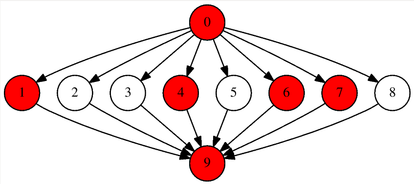

Graph Framework
===============

A framework to create and control graphs in C++, with the possibility of choosing one of the two most common graph implementations, which are based on *adjacencies lists* or *adjacencies matrix*. Also oriented/non-oriented mode is eligible.

## Usage
A real example of usage can be found on my [Dijkstra's Algorithm implementation](https://github.com/pablogomez93/Dijkstra). Also, there is a example.cpp file in this repository with a little example of usage, to watch it compile and run just use make all && make run.<br/>

To create a new Graph just use one of the following constructors:
```c++
//Creates an empty graph, non-oriented and based on adjacencies matrix
Graph g();
```
```c++
//Identical previous but initialized with nodes_count nodes
Graph g(unsigned int nodes_count);
```
```c++
//Identical previous but orientation prop specified
Graph g(unsigned int nodes_count, bool is_oriented);
```
```c++
//Identical previous but implementation specified, it can be ADJACENCIES_MATRIX or ADJACENCIES_LIST
Graph g(unsigned int nodes_count, bool is_oriented, Graph::IMPL implementation);
```
Then you are ready to use one of the available methods ([Full documentation here](#documentation)), for example:
```c++
#include "graph.h"
//...
unsigned int nodes = 10;
Graph g(nodes, true);
for (unsigned int current = 1; current < nodes; current++) {
    g.applyEdge(0, current);
    g.applyEdge(current, nodes-1);
    
    g.paintNode(rand()%nodes); //Paint random nodes
}
cout << g.getDOT(false);
```
Then, executing the previous code and dumping it, will give us a visual image of the graph:

    ./example | dot -Tps -o graph.ps

## Tests and Stress tests

There are also included a test suite which run some test to check the correcteness of the graph actions.<br/>
To run the included test you just must execute:

    make test

There is an stress_test too to put the graph under presion and check if it supports the charge.<br/>
If you wanna run it, you must be careful because it may put slow your computer for a while. To run it just do:

    make stress_test

## Documentation
```c++
/*
 * Applies an edge with a weight (optional), between two diferent nodes v1 and v2 (nodes must be already applied to the graph).
 * This method is util when the graph has weight in each edge.
 */
void applyEdge(unsigned int v1, unsigned int v2, float weight = 1);
```
```c++
/*
 * In non-oriented graph, returns if nodes v1 and v2, are adjacents, that means if exist an edge between both.
 * If graph is oriented, returns if exist an edge from node v1 to node v2.
 */
bool areAdjacent(unsigned int v1, unsigned int v2) const;
```
```c++
/*
 * Return if the graph is oriented or not, true if it is.
 */
bool isOrientedGraph() const;
```
```c++
/*
 * Get the cuantity of nodes are now in the graph.
 */
unsigned int getNodesCount() const;
```
```c++
/*
 * Get the cuantity of edges are now inserted in the graph.
 */
unsigned int getEdgesCount() const;
```
```c++
/*
 * Return all edges of the graph, in a vector.
 */
list<Graph::Edge>& getEdges();
```
```c++
/*
 * Add a new vertex, with out adjacents.
 * Increases n by one.
 */
unsigned int addVertex();
```
```c++
/*
 * Return the weight of the edge between nodes v1 and v2. If the graph is non-oriented, the orden of the parameters
 * doesn't matter, but it's important in a oriented graph, v1 indicates the origin of the edge, and v2 indicates the end.
 */
float getEdgeWeight(unsigned int v1, unsigned int v2) const;
```
```c++
/*
 * Return an iterator of the adjacents nodes for a single node in the graph.
 */
const AdjacentsIterator adjacentsOf(unsigned int v) const;
```
```c++
/*
 * Test if a node is isolated or not
 */
bool isIsolatedNode(unsigned int) const;
```
```c++
/*
 * Paint a node to remark it on the graphic output
 */
void paintNode(unsigned int v);
```
```c++
/*
 * Unpaint a painted node
 */
void unpaintNode(unsigned int v);
```
```c++
/*
 * Paint an edge to remark it on the graphic output
 */
void paintEdge(Edge* v);
```
```c++
/*
 * Unpaint a painted edge
 */
void unpaintEdge(Edge* v);
```
```c++
/*
 * Get the .DOT format representation of the graph.
 * Useful to pipe it to a .DOT graphical tool.
 */
string getDOT(bool weighted = true) const;
```
```c++
/*
 * Export the graph into a file, in the standard DOT format for representing graphs.
 */
void exportDOT(const char* fileName, bool force_override = false) const;
```
